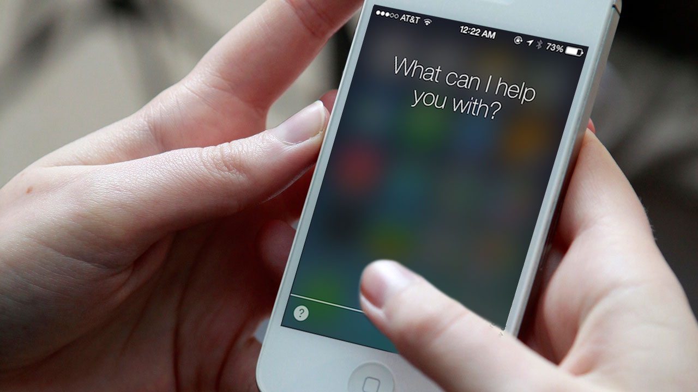
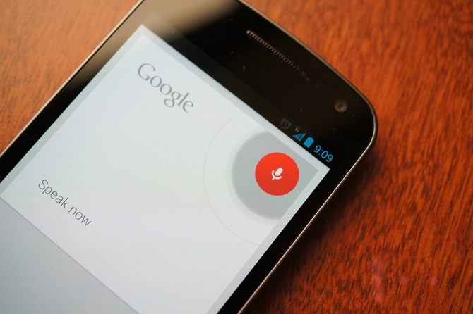
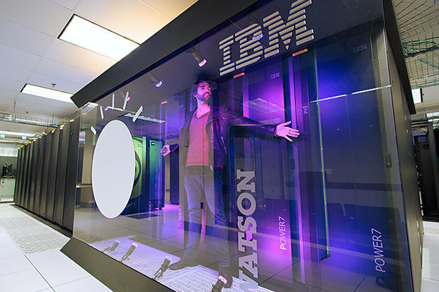
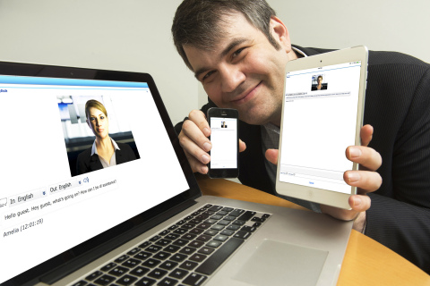

<html>
<head>
<title>PAGE2</title>
<meta http-equiv="Content-Type" content="text/html; charset=UTF-8"/>

</head>
<body bgcolor="#CDC7CB">
<h1 align="center"><b>YAPAY ZEKA</b></h1>

Bilgisayar teknolojilerinin yeni ortaya ��kt��� d�nemde, �Makineler d���nebilir mi?� sorusunun Mathison Turing taraf�ndan sorulmas� ile yapay zeka hakk�nda ilk ad�mlar at�lmaya ba�land�. Turing, geli�tirmi� oldu�u �e�itli makineler arac�l���yla �kinci D�nya Sava�� boyunca Almanlar�n �ifrelerini ��zerken Heath Robinson, Bombe ve Colossus gibi ilk �rneksel bilgisayarlar�n da yarat�c�s� olmu�tu. Yine kendi geli�tirdi�i Turing testi ile makinelerin ne denli d���nme yetisine sahip olduklar�n� sorgulayan bir k�stas ortaya ��kard�. �e�itli �ifre algoritmalar� ve veri �al��malar� ile birlikte ortaya ��kan Makine Zekas� kavram�, ilk bilgisayarlardan bug�nk� ak�ll� telefonlara kadar �retilen t�m teknolojik cihazlar�n, insan temel al�narak geli�tirildi�ini ortaya koymaktad�r. Eski d�nemlerde �ok yava� geli�se de g�n�m�ze kadar �nemli ad�mlar�n at�ld��� yapay zekada, bug�n yetenekli robotlar�n ortaya ��kmas� ile ne kadar ilerlendi�ini ortaya koymaktad�r.

G�n�m�z i�letmelerin rekabet edebilirlikleri ve h�zl� de�i�ime ayak uydurmalar� inovasyonun �stlendi�i rol itibariyle hayati bir �nem ta��maktad�r. Son zamanlarda bakt���m�zda i�letmelerin farkl� stratejilerilerinde, teknoloji ve beraberinde inovasyon (yenilik) kavramlar� ile rekabet etti�i g�r�lmektedir. ��letmeler teknoloji �a��ndaki geli�melere ayak uydurmak i�in bilgisayar teknolojisinden istifade ederek zeki sistemlere y�nelmeye ba�lam��t�r ve bu konuda devreye b�t�n�yle yapay zeka girmektedir. Yapay zeka, insan beyni ve zekas�n�n karakteristik �zelliklerinden yola ��karak makinelerin karma��k problemlere insanlar gibi ��z�mler �retmesini sa�lama ile ilgilenen bir bilim dal�d�r. G�n�m�zde yapay zekan�n kullan�lma potansiyeli olan ve kullan�lan binlerce uygulama alan� bulunmaktad�r. Bu alanlar otonom kontrol� ve hedef tespiti gibi askeri uygulamalardan, bilgisayar oyunlar� ve robotik hayvanlar gibi e�lence d�nyas�na kadar geni� bir yelpazede de�erlendirebilir ve bilim adamlar�, ilerleyen y�llar i�erisinde, �ayet insan beynindeki n�ronlara kadar inerek buradaki bilgileri kopyalayabilirlerse t�pk� insan gibi davranabilen zekal� makineler, robotlar yap�labilece�ini d���n�yorlar.

Yapay zekay� her ne kadar hep "v�cutlu bir robot" olarak d���nsek de, asl�ndan bundan �ok daha fazlas�d�r. Evlerimizde ve hatta ceplerimizdeki bir�ok elektronik e�ya yapay zeka ile donat�lm�� durumda. Burada basitten karma���a do�ru 5 yapay zeka sistemini �rnek olarak bulunmaktad�r. Bunlar�n baz�lar� hen�z ceplerimizde olan yaz�l�mlar de�il; ancak teknoloji geli�tik�e, t�pk� oda b�y�kl���ndeki bilgisayarlar�n ceplerimize girmesi gibi, bu yapay zeka ara�lar� da ceplerimizdeki ve evlerimizdeki yerini alacak.

1) Apple Siri

<left>

</left>

Yapay zeka jargonunda "kitap dahisi" diyebilece�imiz d�zeyde olan Apple Siri, sordu�unuz sorulara cevaplar verebilecek kapasitede. �rne�in bir yeme�in tarifini sordu�unuzda, Google ya da Wikipedia gibi ara�lar� kullanarak sonu�lar ��karabilecek ve size sunabilecek durumda. Ayr�ca Siri, cevab� �ok bariz olan baz� sorulara cevap verme ve bariz emirlerinize itaat etme gibi yeteneklere de sahip. �rne�in Siri'yi kullanarak hava durumunu ��renebilir, istedi�iniz ki�iyi arayabilir, ajandan�za i�ledi�iniz bir toplant�n�n adresini GPS ile bulmas�n� ve sizi y�nlendirmesini sa�layabilir. Bu bak�mdan, �ok temel d�zeyde bir asistan olarak d���nebilirsiniz. Art�k yapay zeka sayesinde, herhangi bir �eyi yazarak zaman kaybetmenize gerek yok. Tek yapman�z gereken, telefonunuz ile konu�mak.

2) Microsoft Cortana

<left>

</left>

Microsoft'un yapay zekas� Siri'nin �zerine birka� �zellik ekleyerek bir ad�m �ne ge�iyor. �rne�in daha �nceden sordu�unuz bir sorunun kendisini ve cevab�n� hat�rlayarak, sonraki sorular�n cevaplar�n� daha etkili bir �ekilde bulabiliyor. Hatta Cortana, i�i biraz daha b�y�terek sizin ki�iler, nesneler ve yerler i�in kulland���n�z takma isimleri bile ��renebiliyor. �rne�in evinize gitmek istedi�inizde her seferinde evinizden "in" ya da "ah�r" olarak bahsedecek olursan�z, birka� seferden sonra size ne demek istedi�inizi sormadan, demek istedi�inizi anlayabiliyor! Yani eviniz ile "ah�r�n�z�" haf�zas�nda e�lemeyi ba�ar�yor. Bu, ��renen makinalar�n en temel �zelliklerinden birisi ve geli�tirildi�inde ba� d�nd�r�c� sonu�lar� beraberinde getirecek.

3) Google Now

<left>

</left>

Tabii ki rekabet s�z konusu oldu�unda, Google ile ba�a ��kmak bir hayli zor. Google, Cortana'n�n ��renme algoritmas�n� biraz daha karma��kla�t�rarak, sizinle sohbet edebiliyor. �rne�in Google Now'a "Eve gitmek istiyorum." dedi�inizde, sizi oraya y�nlendiriyor. Ancak bu i�lem tamamland�ktan sonra, herhangi ba�ka bir bilgi vermeksizin "Sence ne kadar s�rede oraya var�r�m?" diye sordu�unuzda, "ora"dan kast�n�z�n ne oldu�unu anlayabilir. Bu kula�a �ok basit geliyor; ancak makinalar i�in m�thi� bir ad�m. Bir di�er �rnek olarak "Arda Turan hangi tak�mda oynuyor?" diye sorabilirsiniz. Ona cevap ald�ktan hemen sonra, "Boyu ka� metre?" ya da "Ka� gol atm��?" diye soracak olursan�z, size "Kim ka� gol atm��?" diye sorunuzu tekrar ettirmeye gerek duymadan, cevab� verebiliyor. Bu, ger�ek insan-makina diyaloglar� konusunda b�y�k bir ad�m.

4) IBM Watson

<left>

</left>

Watson, yapay zekan�n g�z bebeklerinden birisi. Watson, karmakar���k hastane kay�tlar�n� analiz ederek, mant�kl� desenler ke�fedebiliyor ve bundan ��rendi�i sonu�lar� size sunabiliyor. Dahas�, doktorlar�n �ng�remeyece�i kadar veriyi bir arada i�leyerek, te�his ve tan�da tavsiyelerde bulunuyor. Hatta daha �nceden g�rd��� hastalardan yola ��karak, tedavinin de en uygun nas�l yap�labilece�i konusunda fikirler ileri s�rebiliyor. Yani Watson, gelecekte hastanelerde size bakacak, tan�y� koyacak ve tedavi edecek doktorlardan biri olabilir. Elbette, daha �nceden sayd���m�z 3 yaz�l�mda oldu�u gibi, sizinle rahatl�kla diyaloga girebiliyor, uzun sohbetler yapabiliyor. 

5) IPsoft Amelia

<left>

</left>

Yapay zeka camias�n�n yeni y�ld�zlar�ndan Amelia, art�k ticari bir �r�n olarak da sat��a ��kar�ld�. Amelia'y� di�erlerinden ay�ran �nemli fark duygusal fark�ndal�k eklenmi� olmas�d�r. Gelecekte bu sistemin m��teri hizmetlerinin yerini tamamiyle almas� bekleniyor. ��nk� �u anda otomatik m��teri hizmetleri makinalar�n�n aksine, m��terilerin ses tonlar�ndan yola ��karak onlar�n duygusal hallerini alg�layabiliyor ve ona uygun duygularla cevap veriyor. Sadece mant�ksal ��kar�mlarda de�il, duygusal ��kar�mlarda da bulunuyor. Bu bak�mdan, yapay zeka jargonunda "sokak dahisi" olarak an�l�yor. Yani Apple Siri'de olan "entellekt�el kitap bilgilerinin" �tesinde, sokaktaki herhangi bir insana hitap edebilecek bir d�zeyde oldu�u s�ylenilebilir.

<b>�nsan Zekas� ve Yapay Zeka Aras�ndaki Farkl�l�klar Tablosu</b>

<table border="5">
<tr>
<th> Nitelikler </th>
<th> �nsan Zekas� </th>
<th> Yapay Zeka </th>
</tr>
<tr>
<td>
Duyu kullanma becerisi
</td>
<td>
Fazla
</td>
<td>
Az
</td>
</tr>
<tr>
<td>
Yarat�c� ve hayalperest olma becerisi
</td>
<td>
Fazla
</td>
<td>
Az
</td>
</tr>
<tr>
<td>
Deneyimlerden ��renme becerisi
</td>
<td>
Fazla
</td>
<td>
Az
</td>
</tr>
<tr>
<td>
�e�itli bilgi kayna�� kullanabilme becerisi
</td>
<td>
Fazla
</td>
<td>
Fazla
</td>
</tr>
<tr>
<td>
Karma��k hesap yapabilme becerisi
</td>
<td>
Az
</td>
<td>
Fazla
</td>
</tr>
<tr>
<td>
Bilgi aktarma becerisi
</td>
<td>
Az
</td>
<td>
Fazla
</td>
</tr>
</table>

<b>Di�er Sayfalar ��in:</b>

<a href="index.html">�lk Sayfa</a>

<a href="page3.html">���nc� Sayfa</a>

</body>
</html>
